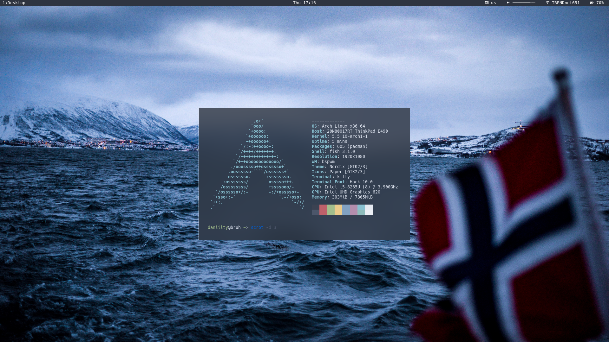

<h1 align="center"> That's how da setup looks like</h1>
</img>
<h2>Stuff you'll need:</h2>
<ul>
	<li>compton-tryone fork</li>
	<li>feh</li>
	<li>rofi</li>
	<li>polybar</li>
	<li>siji-git</li>
	<li>ttf-hack</li>
	<li>glorious ARCH ofc</li>
</ul>
